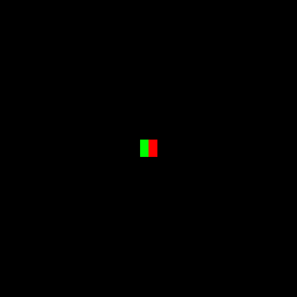
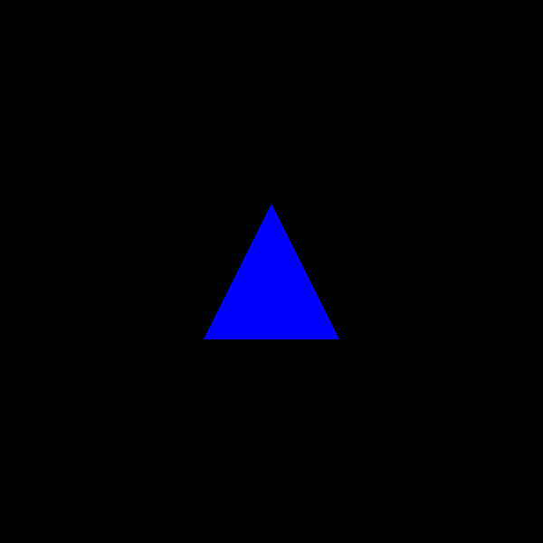
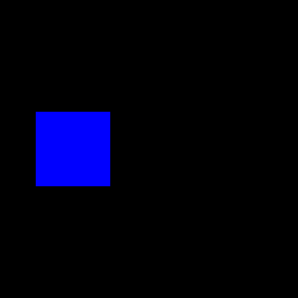
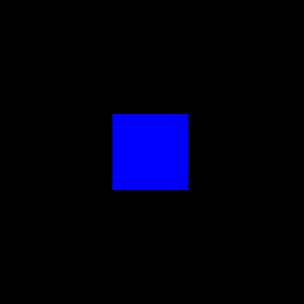
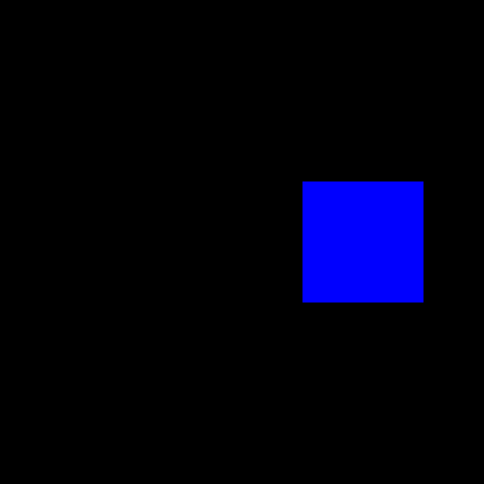

# Result——Designed by peichu Ye

1. **background**

2. **drawPoint**

3. **detectException**

Note that there is an error occurs after glewInit(), but it doesn't matters because we can find the declaration on the [website](https://www.khronos.org/opengl/wiki/OpenGL_Loading_Library).

4. **readShaderSource**

We add a funtion to read shader source from files which is useful in the next program. And you can modified the position and color in the config files.

5. **drawTriangle**

In this part, we draw a triangle, we first draw a right triangle and then draw an isosceles triangle which is the practice in this chapter.

6. **drawTriangleMoving**

In this section, we modified the vertex shader file, and we draw a moving square. If you want to draw a triangle, please modified the shader file.

