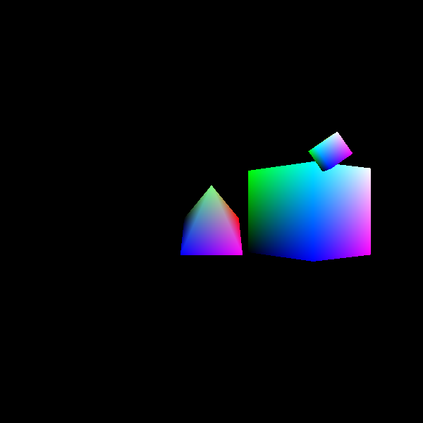
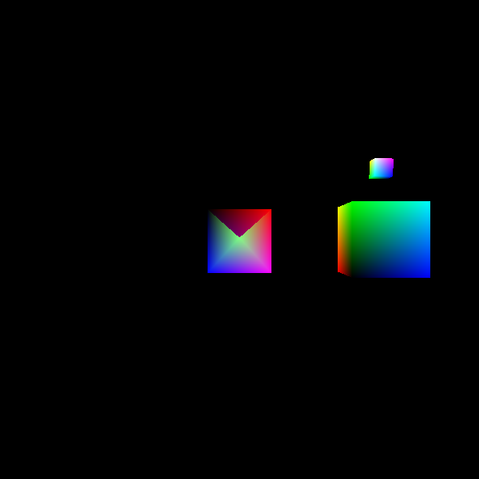

# Result——Designed by peichu Ye

1. **drawCube**

In this section, we draw a yellow cube which uses buffer to load the vertices.

2. **drawCubeColor**

To modify the color of the cube, we use the different shaders which outputs the varyingColor to the fragment shader.

3. **drawCubeRotate**

The uniform values are used to transform the transformation matrix from vertices shader to buffers.

4. **drawMultipleCubes**

To draw 24 cubes, we set a loop with 24 times.

5. **drawMultipleCubesInstance**

In this section, we replace "glDrawArrays" with "glDrawArraysInstanced" to create many instances. Note that we modify many codes in vertices shader even we write many functions.

6. **drawMultipleGeometries**

We use two buffers to save cube and pyramid. Note that we should declear two model vertices in init() function. And transform the view-model matrix to the vertices shader.

7. **drawPlanets**

In this section, we build a simulated solar system and two buffers are used.

